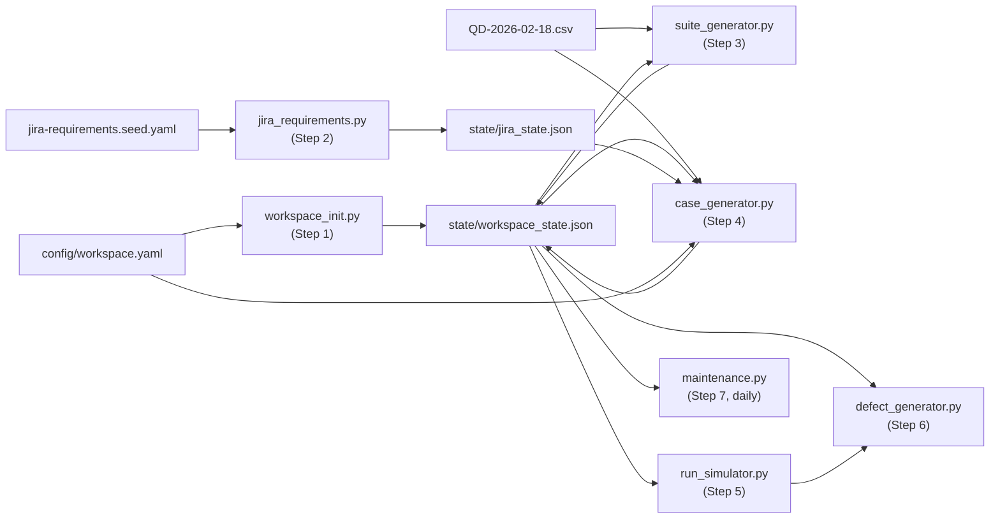

# SpecKit Workflow Plan — Qase Living Workspace

---

## CSV Source of Truth

`[QD-2026-02-18.csv](QD-2026-02-18.csv)` contains both the suite structure and all test case data.

**Suite rows** (31 rows): `id` and `title` are empty; `suite_without_cases=1`; columns `suite_id`, `suite_parent_id`, `suite` define the full hierarchy.

**Test case rows** (120 rows): all fields populated including `steps_actions/steps_result/steps_data` (multi-line), and custom field values in `cf_6`–`cf_10`.

Suite hierarchy extracted from CSV:

```text
01 Authentication  (suite_id=2, no parent)
  ├── Registration           (id=9,  parent=2)
  ├── Login & Sessions       (id=11, parent=2)
  └── Password Reset         (id=12, parent=2)
02 Search & Browse (suite_id=1, no parent)
  ├── Filters & Facets       (id=8,  parent=1)
  ├── Category Browse        (id=10, parent=1)
  ├── Search Results         (id=13, parent=1)
  └── Product Detail (PDP)   (id=17, parent=1)
03 Cart & Promotions (suite_id=3, no parent)
  ├── Promo Codes            (id=14, parent=3)
  ├── Cart Persistence/Merge (id=18, parent=3)
  └── Cart Basics            (id=16, parent=3)
04 Checkout (suite_id=6, no parent)
  ├── Guest Checkout         (id=15, parent=6)
  ├── Address & Shipping     (id=19, parent=6)
  ├── Payment                (id=22, parent=6)
  └── Confirmation           (id=23, parent=6)
05 Orders (suite_id=4, no parent)
  ├── Order History          (id=24, parent=4)
  ├── Cancellation           (id=25, parent=4)
  └── Shipment Tracking      (id=27, parent=4)
06 Returns & Refunds (suite_id=7, no parent)
  ├── Returns                (id=20, parent=7)
  └── Refund Status          (id=26, parent=7)
07 Admin (suite_id=5, no parent)
  ├── Catalog Management     (id=21, parent=5)
  ├── Order Operations       (id=28, parent=5)
  ├── Roles & Permissions    (id=29, parent=5)
  └── Promotions Management  (id=30, parent=5)
```

Custom field column mapping (from CSV `cf_*` headers → canonical field names):


| CSV column | Custom field name | Type                                 |
| ---------- | ----------------- | ------------------------------------ |
| cf_6       | Component         | selectbox                            |
| cf_7       | User Journey      | selectbox                            |
| cf_8       | Risk Level        | selectbox                            |
| cf_9       | Automation Status | selectbox                            |
| cf_10      | Test Data Profile | multiselect (comma-separated values) |


---

## Data & State Flow

Every script reads its inputs and writes its outputs to the `state/` directory. No IDs are ever hardcoded.




### `state/workspace_state.json` schema

Written by `workspace_init.py`, extended by `suite_generator.py` and `case_generator.py`:

```json
{
  "project_code": "AB",
  "milestone_ids": { "Sprint 1 – Foundation": 1, "Sprint 2 – Cart & Checkout": 2 },
  "environment_ids": { "Staging": 3, "Production": 4 },
  "custom_field_ids": {
    "Component": 5, "User Journey": 6, "Risk Level": 7,
    "Automation Status": 8, "Test Data Profile": 9
  },
  "custom_field_option_ids": {
    "Component": { "Web UI": 1, "Backend API": 2, "Payments": 3, "Search": 4, "Admin": 5 }
  },
  "configuration_group_ids": { "Browser": 10, "Device": 11 },
  "shared_step_hashes": { "Login flow": "abc123" },
  "suite_ids": { "1": 101, "2": 102, "3": 103 },
  "case_ids": { "1": 201, "2": 202 }
}
```

### `state/jira_state.json` schema

Written by `jira_requirements.py`:

```json
{
  "story_ids": { "QD-5": "10001", "QD-6": "10002" },
  "epic_ids":  { "auth": "QD-5",  "search": "QD-6" }
}
```

---

## Configuration Model

### `config/workspace.yaml` (complete structure)

```yaml
project:
  name: "ShopEase Web App"
  description: "Living demo workspace for ShopEase e-commerce QA"
  access: none          # private

custom_fields:
  - name: "Component"
    type: selectbox
    options: [Web UI, Backend API, Payments, Search, Admin]
  - name: "User Journey"
    type: selectbox
    options: [New user, Returning user, Guest, Admin]
  - name: "Risk Level"
    type: selectbox
    options: [High, Medium, Low]
  - name: "Automation Status"
    type: selectbox
    options: [Not Automated, Candidate, Automated]
  - name: "Test Data Profile"
    type: multiselect
    options: [US address, EU address, Out-of-stock, Discount eligible, 3DS required]

milestones:
  - title: "Sprint 1 – Foundation"
  - title: "Sprint 2 – Cart & Checkout"
  - title: "Sprint 3 – Orders & Admin"

environments:
  - title: Staging
    slug: staging
    host: https://staging.shopease.example.com
  - title: Production
    slug: production
    host: https://www.shopease.example.com

configurations:
  - group: Browser
    items: [Chrome, Firefox, Safari, Edge]
  - group: Device
    items: [Desktop, Mobile, Tablet]

# Maps CSV column names to canonical custom field names
cf_column_map:
  cf_6: "Component"
  cf_7: "User Journey"
  cf_8: "Risk Level"
  cf_9: "Automation Status"
  cf_10: "Test Data Profile"

# Maps top-level suite names to Jira epic slugs (for requirement linking)
suite_domain_map:
  "01 Authentication":   auth
  "02 Search & Browse":  search
  "03 Cart & Promotions": cart
  "04 Checkout":         checkout
  "05 Orders":           orders
  "06 Returns & Refunds": orders
  "07 Admin":            admin

seed:
  cases_csv: "QD-2026-02-18.csv"
  seed_value: 42

simulation:
  history_months: 3
  pass_rate_range: [0.85, 0.92]
  weak_suite: "04 Checkout"
  run_types: [Regression, Feature, Smoke]
```

---

## Existing Script Audit (Revised)


| Script                                    | Status             | Action                                                                    |
| ----------------------------------------- | ------------------ | ------------------------------------------------------------------------- |
| `jira_bulk_create_requirements.py` (root) | Complete           | Move to `scripts/jira_requirements.py`; add `state/jira_state.json` write |
| `scripts/jira_utils.py`                   | Complete           | Keep unchanged                                                            |
| `scripts/qase_seed_utils.py`              | Complete           | Keep; extend with `load_state()` / `save_state()` helpers                 |
| `scripts/qase_verify_token.py`            | Complete           | Keep unchanged                                                            |
| `scripts/qase_seed_custom_fields.py`      | Superseded         | Logic absorbed into `workspace_init.py`; delete                           |
| `scripts/qase_seed_cases_from_jira.py`    | Superseded         | Replaced by `case_generator.py` (CSV-driven); delete                      |
| `scripts/qase_link_cases_to_jira.py`      | Superseded         | Logic merged into `case_generator.py`; delete                             |
| `scripts/qase_update_case_titles.py`      | One-off utility    | Move to `scripts/utils/`                                                  |
| `scripts/custom_fields_map.json`          | Generated artifact | Keep pattern; replaced by `state/workspace_state.json`                    |


---

## Target Repository Structure

```text
.specify/
  memory/
    constitution.md              ← complete (v1.1.0)
  templates/                     ← untouched

specs/
  001-workspace-foundation/
    spec.md / plan.md / tasks.md
  002-test-case-seeding/
    spec.md / plan.md / tasks.md
  003-activity-simulation/
    spec.md / plan.md / tasks.md

config/
  workspace.yaml                 ← NEW (full schema above)

state/                           ← git-ignored; written at runtime
  workspace_state.json
  jira_state.json

scripts/
  workspace_init.py              ← NEW
  jira_requirements.py           ← MOVED + jira_state write added
  suite_generator.py             ← NEW (CSV-driven)
  case_generator.py              ← NEW (replaces 3 existing scripts)
  run_simulator.py               ← NEW
  defect_generator.py            ← NEW
  maintenance.py                 ← NEW
  jira_utils.py                  ← unchanged
  qase_seed_utils.py             ← extend with state helpers
  qase_verify_token.py           ← unchanged
  utils/
    qase_update_case_titles.py   ← archived

.github/
  workflows/
    daily-activity.yml           ← NEW (twice-daily cron)

api/                             ← unchanged
assets/                          ← unchanged
QD-2026-02-18.csv                ← unchanged (source of truth)
jira-requirements.seed.yaml      ← unchanged
.env.example                     ← extend with QASE_API_TOKEN
```

---

## Milestone 1 — Workspace Foundation

### Script 1: `workspace_init.py`

**Responsibilities:**

1. `GET /projects` → collect all existing project codes → pick first unused 2-letter alphabetic code (AA, AB, … ZZ)
2. `POST /project` with the selected code, name, description → store `project_code` + `project_id` in state
3. `GET /custom-fields` → for each of the 5 required fields: if found by name, capture ID + option IDs; if not found, `POST /custom-field` → store all in state
4. `POST /environment` for each environment in config → store `environment_ids` in state
5. `POST /milestone` for each milestone in config → store `milestone_ids` in state
6. `POST /configurations` (group + items) from config → store `configuration_group_ids` in state
7. `POST /shared-step` for reusable steps (login flow, add-to-cart flow) → store `shared_step_hashes` in state
8. Write complete `state/workspace_state.json`

**Idempotency rule:** `GET` before every `POST`; skip create if resource with same name/code already exists.

### Script 2: `jira_requirements.py`

Existing `jira_bulk_create_requirements.py` (complete and correct) with one addition:

- Write `state/jira_state.json` with `{story_ids: {jira_key: jira_internal_id}, epic_ids: {slug: jira_key}}` after creation
- All IDs retrieved from the bulk create response, not hardcoded

### Script 3: `suite_generator.py`

**Responsibilities:**

1. Read CSV; extract rows where `suite_without_cases == "1"` → these are the suite definitions
2. Topological sort: create parent suites before child suites (sort by `suite_parent_id is None` first, then by level)
3. For each suite, `POST /suite/{project_code}` with `title` and `parent_id` (looked up from state's already-created suites)
4. Accumulate `{csv_suite_id: new_qase_suite_id}` mapping → write into `state/workspace_state.json`

**CSV suite creation order** (parents before children):

- Pass 1: rows with no `suite_parent_id` (the 7 top-level suites)
- Pass 2: rows with `suite_parent_id` pointing to a now-known suite (the 23 leaf suites)

---

## Milestone 2 — Test Case Seeding

### Script 4: `case_generator.py`

**Responsibilities:**

1. Read `config/workspace.yaml` (cf_column_map, suite_domain_map, seed)
2. Read `state/workspace_state.json` (project_code, suite_ids, custom_field_ids, option_ids)
3. Read `state/jira_state.json` (story_ids, epic_ids)
4. Parse CSV test case rows (skip suite-only rows)
5. For each row, translate string values to API integers using the enum map:

```python
# this is not accurate; please query the API for system fields and build a map, before using them. 
# It's always possible that the user may have customized some of these values in their workspace.

ENUM_MAP = {
  "priority":   {"not set": 0, "high": 1, "medium": 2, "low": 3},
  "severity":   {"not set": 0, "blocker": 1, "critical": 2, "major": 3,
                  "normal": 4, "minor": 5, "trivial": 6},
  "status":     {"actual": 0, "draft": 1, "deprecated": 2},
  "automation": {"none": 0, "planned": 1, "automated": 2},
  "behavior":   {"positive": 2, "negative": 3, "destructive": 4},
  "layer":      {"unknown": 0, "e2e": 1, "api": 2, "unit": 3},
  "is_flaky":   {"no": 0, "yes": 1},
}
```

1. Parse multi-line steps from `steps_actions`, `steps_result`, `steps_data` columns (split on `\n`, strip numbered prefix `"N. "`)
2. Map `cf_*` column names → canonical field names (via `cf_column_map`) → new field IDs (from state)
3. Map `suite_id` from CSV → new Qase suite ID (via state `suite_ids`)
4. Assign Jira story: look up suite's domain (via `suite_domain_map`), then round-robin stories from that domain's story IDs list
5. Bulk-create in batches of 30 via `POST /case/{code}/bulk`
6. After all cases created, link each case to its Jira story ID via `POST /case/{code}/external-issue/attach` using Jira **internal IDs** (not display keys)
7. Write `{csv_case_id: new_qase_case_id}` into `state/workspace_state.json`
8. Support `--dry-run` flag: print distribution plan without API calls

**Enum constraints from `[constraints.md](constraints.md)` that must be respected:**

- `custom_field` values must be stored as **strings** (convert option IDs to `str()` before sending)
- `is_flaky` must be `0` or `1` integer, not boolean
- Multiselect (cf_10) values must be comma-joined option IDs as a single string

---

## Milestone 3 — Activity Simulation

### Script 5: `run_simulator.py --backfill`

- Read `state/workspace_state.json` for project_code, case_ids, environment_ids, milestone_ids
- Using seeded RNG (seed from config), generate ~3 months of dated run + result records
- Mixed run types: Regression (full suite), Feature (scoped to one domain), Smoke (critical path subset)
- Pass/fail distribution: 85–92% overall; "04 Checkout" suite cases at consistently lower rate
- Batch-create runs and results; respect ≤5 req/sec throttle

### Script 6: `defect_generator.py`

- Read failed results from run history (via `GET /result/{code}?status=failed`)
- For each failed result (above threshold), `POST /defect/{code}` with severity derived from case's Risk Level
- Link defect to result (`defect_id` stored in result comment or a local state file)
- Resolve a portion of existing open defects (to show active maintenance)
- Required fields per `[constraints.md](constraints.md)`: `title`, `project_id`, `author_id`, `status`

### Script 7: `maintenance.py` (twice-daily)

- Adds one fresh run (mixed type based on day-of-week seed)
- Adds results for all cases in that run
- Triggers incremental defect creation/resolution cycle
- Reads everything from `state/workspace_state.json`; writes nothing to state (state is stable after seeding)

### `.github/workflows/daily-activity.yml`

- Cron: `0 6,18 * * *` (6am + 6pm UTC)
- Steps: checkout repo → set up Python → run `maintenance.py`
- All credentials from GitHub Secrets: `QASE_API_TOKEN`, `JIRA_API_TOKEN`, `JIRA_EMAIL`, `JIRA_BASE_URL`, `JIRA_PROJECT_KEY`

---

## Step-by-Step Rollout

### Phase 0 — Housekeeping (before any SpecKit commands)

1. Move `jira_bulk_create_requirements.py` → `scripts/jira_requirements.py`
2. Move `scripts/qase_update_case_titles.py` → `scripts/utils/`
3. Delete: `scripts/qase_seed_custom_fields.py`, `scripts/qase_seed_cases_from_jira.py`, `scripts/qase_link_cases_to_jira.py` (all superseded)
4. Create `config/workspace.yaml` using the full schema above
5. Create `state/` directory; add `state/` to `.gitignore`
6. Extend `scripts/qase_seed_utils.py` with `load_state(path)` / `save_state(path, data)` helpers
7. Update `.env.example` to document `QASE_API_TOKEN` (Jira vars already present)
8. Update `README.md` with canonical 7-step execution order

### Phase 1 — Milestone 1: Workspace Foundation

```
/speckit.specify  specs/001-workspace-foundation
/speckit.plan     specs/001-workspace-foundation/spec.md
/speckit.tasks    specs/001-workspace-foundation/
```

Implement: `workspace_init.py`, `jira_requirements.py` (state write addition), `suite_generator.py`

### Phase 2 — Milestone 2: Test Case Seeding

```
/speckit.specify  specs/002-test-case-seeding
/speckit.plan     specs/002-test-case-seeding/spec.md
/speckit.tasks    specs/002-test-case-seeding/
```

Implement: `case_generator.py` (new file; replaces 3 existing scripts)

### Phase 3 — Milestone 3: Activity Simulation

```
/speckit.specify  specs/003-activity-simulation
/speckit.plan     specs/003-activity-simulation/spec.md
/speckit.tasks    specs/003-activity-simulation/
```

Implement: `run_simulator.py`, `defect_generator.py`, `maintenance.py`, `daily-activity.yml`

### Phase 4 — End-to-End Verification

Run all 7 scripts in canonical order against a fresh Qase workspace:

- Project code auto-selected (not QD)
- Suite count: 7 parent + 23 leaf = 30 total
- Case count: 120 cases, ≤6 per leaf suite, all linked to Jira
- All 5 custom fields populated on every case
- 3-month backfill visible in analytics
- "04 Checkout" suite shows visibly lower pass rate
- `maintenance.py` run twice with no errors or duplicate creates

---

## Constitution Compliance Gates

Every `plan.md` `Constitution Check` section must verify:


| Gate                                   | Principle                  | Pass condition                                               |
| -------------------------------------- | -------------------------- | ------------------------------------------------------------ |
| Credentials only in env/secrets        | Security                   | All tokens read from `os.environ`                            |
| No hardcoded project codes or IDs      | Security / Reproducibility | All IDs from `state/*.json` or config                        |
| API calls consult `api-index.md` first | API Reference Guidance     | Documented in research.md                                    |
| Rate limiting enforced                 | Technical Architecture     | ≤5 req/sec with `time.sleep()` between batches               |
| Idempotent execution                   | Automation Structure       | GET-before-POST on all create operations                     |
| Case count fixed after seeding         | Principle VI               | Scripts 5–7 never touch case/suite structure                 |
| Enum values from `constraints.md`      | Entity Constraints         | Enum map in case_generator.py matches constraints.md exactly |


